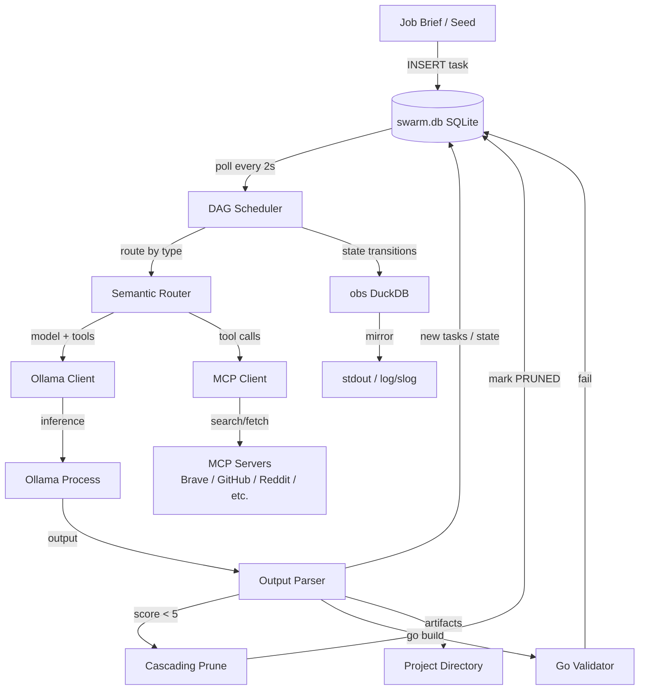

# Execution Plan - Autonomous Local Swarm

**Skill:** spec-agent
**Tool:** claude-code
**Model:** claude-sonnet-4-5
**Feature:** 0000001-autonomous-local-swarm
**Version:** 0.1.0
**Status:** active

---

## Functional Requirements Directory

Functional requirements are split into granular files to optimise agent context windows.

See `plan/current/requirements/` for individual requirements.

| File | Requirement |
|---|---|
| `req-001-seed-ingestion.md` | Seed task creation and project initialisation |
| `req-002-dag-scheduler.md` | DAG scheduler loop and task dispatch |
| `req-003-ollama-integration.md` | Ollama HTTP client and model routing |
| `req-004-vram-management.md` | VRAM guardrails and model swap strategy |
| `req-005-variational-execution.md` | Variational execution and judge selection |
| `req-006-viability-and-prune.md` | Viability review gating and cascading prune |
| `req-007-self-correction.md` | Go build validation and self-correction loop |
| `req-008-context-compression.md` | Context threshold detection and SUMMARY task emission |
| `req-009-mcp-integration.md` | MCP client registration and tool dispatch |
| `req-010-output-deposit.md` | Artifact deposit to project directory |
| `req-011-observability.md` | DuckDB event log and stdout mirror |
| `req-012-mcp-reddit.md` | Custom Reddit MCP server |

---

## Non-Functional Requirements

| ID | Category | Requirement | Target | Measurement |
|----|----------|------------|--------|-------------|
| NFR-001 | Performance | Scheduler loop picks up newly unblocked tasks | ≤ 2 seconds from prerequisite completion | Time from task status update to next dispatch |
| NFR-002 | Performance | Ollama keep_alive enforcement | Model cleared from VRAM within 1 request cycle after swap | VRAM monitor / Ollama status API |
| NFR-003 | Reliability | Self-correction loop max retries | Maximum 5 self-correction attempts per task before marking failed | Retry counter in task metadata |
| NFR-004 | Reliability | Variational candidate count | Exactly 3 candidates generated per variational task | task_candidates row count |
| NFR-005 | Reliability | Max recursion depth | Hard stop at depth 5; no task emitted beyond this | depth field constraint in scheduler |
| NFR-006 | Data | Context compression threshold | SUMMARY task emitted when context reaches 70% of model limit | context_path sidecar token count |
| NFR-007 | Data | Viability pruning threshold | Cascading prune triggered on VIABILITY_REVIEW score < 5 | Score field in task metadata |
| NFR-008 | Observability | Event log completeness | Every task state transition produces a DuckDB event row | Event count vs transition count |
| NFR-009 | Security | Credential isolation | No API credentials appear in DuckDB event log, stdout, or task payloads | Log audit |
| NFR-010 | Resilience | MCP tool failure handling | MCP tool failure degrades gracefully; task continues with available context | Error handling in mcp-client |

---

## API Summary

Not applicable — this system is a local daemon. It exposes no HTTP API. All interaction is via the SQLite task queue and the project directory.

---

## Data Model Summary

| Entity | Owner Component | Key Fields | Relationships |
|--------|----------------|------------|--------------|
| `projects` | orchestrator | id, name, status | one-to-many with tasks |
| `tasks` | orchestrator | id, project_id, parent_id, blocked_by, type, model_tag, payload, status, depth, context_path, meta_data | self-referential (parent/blocked_by) |
| `task_candidates` | orchestrator | id, task_id, output_text, evaluation_score, is_selected | many-to-one with tasks |
| `events` | obs | id, timestamp, task_id, task_type, from_status, to_status, model_tag, depth, detail | append-only, no FK to swarm.db |

---

## Component Interactions

---

## Assumptions

| ID | Assumption | Impact if Wrong |
|----|-----------|----------------|
| A-001 | Ollama is running and reachable at localhost before swarm starts | Orchestrator fails at boot; operator must start Ollama first |
| A-002 | All required models are pre-pulled in Ollama | Inference calls fail; operator must `ollama pull` each model |
| A-003 | MCP server processes are started before orchestrator | MCP tool calls fail gracefully; tasks degrade to Ollama-only |
| A-004 | Project directory is writable by the orchestrator process | Output deposit silently fails |
| A-005 | Reddit app credentials are configured before first RESEARCH task uses Reddit MCP | Reddit tool calls return error; task degrades to other sources |

---

## Open Questions

None — all material gaps resolved during Phase 0 coaching.

---

*Generated by spec-agent.*
